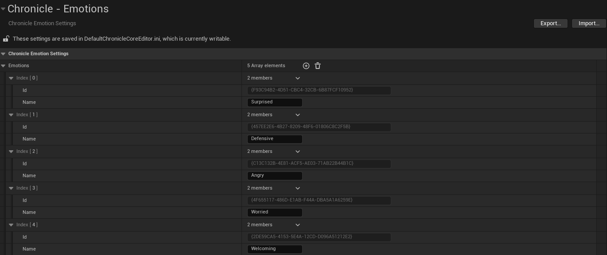

# Character System

**Character System** is a character editor for Unreal Engine, built as part of **Chronicle**. It allows you to create custom **Characters** that can be used in other gameplay systems.

## Example

## How To Use

### Add a model

1. Right click the `Content Browser`
2. Create `Blueprint Class`
3. Select `Chronicle_CharacterActor` as parent class

### Add a character

1. Navigate to `Edit → Project Settings → Chronicle → Characters`
2. Add element to playable or non-playable collection

### Modify character

1. Each character has a **unique GUID** for identification
2. Modify its **name** in the field
3. Add **models** and **animations** that can be used by the character for cinematic sequences

## Integration

To integrate with runtime systems, use **FChronicle_CharacterDirectory** methods. That class provides a structured way to access rules at runtime, ensuring consistent behavior across your dialogue system.

## Inner Integrations

Cinematic Timeline is integrated out of the box with Character System.

## Extend Emotions

Emotions are defined through the **Emotion Subsystem**. To modify them, please navigate to `Edit → Project Settings → Chronicle → Emotions`:

## Planned Features

- **Validator** – Detect conflicts or unused characters
- **Browser** – Visual exploration of all characters
