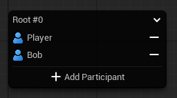
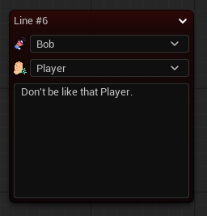
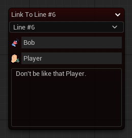
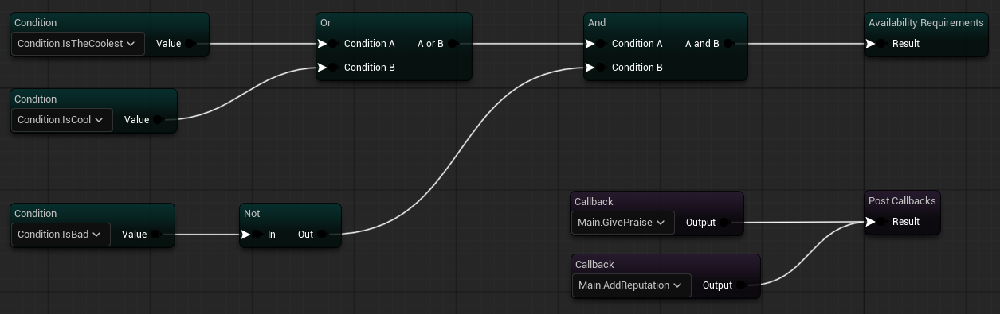
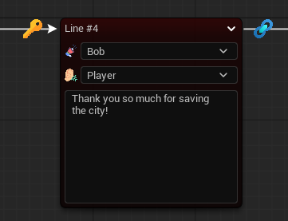

# Dialogue System

**Dialogue System** is a visual dialogue editor for Unreal Engine, built as part of the **Chronicle**. It allows you to design **branching conversations**, define **dialgoue path availability rules**, and trigger **gameplay logic** - all directly inside the editor.

## Example

## Nodes

### Root Node

The **Root Node** is the entry point of every dialogue. It defines the starting point of the conversation and manages its participants.

Within this node, you can:

- Add participants to the dialogue
- Remove participants from the dialogue

This node ensures that the dialogue has a clear starting context.

### Line Node

The **Line Node** represents a single spoken line in the conversation.

It stores:

- Dialogue line content
- Speaker
- Listener

By default, the **Player** is set as the listener, but this can be manually set in node.

### Response Node

The **Response Node** represents a player dialogue choice.

It stores:

- The response text shown to the player

Unlike Line Nodes, Response Nodes do not define a speaker or listener - the **Player** is implicitly the speaker when selecting a response.

### Link Node

The **Link Node** references an existing **Line Node** to avoid unnecessary graph duplication and visual clutter.

The node displays the referenced node’s:

- Dialogue line content (read-only)
- Speaker (read-only)
- Listener (read-only)

This ensures consistency while preventing accidental modification of the original line.

## Node Requirements & Callbacks

**Line** and **Response** nodes can be configured internally through their dedicated node editor.

Each node supports:

- **Availability Requirements** – conditions that must be met for the node to be accessible
- **Post-Execution Callbacks** – logic executed after the node runs

### Node Graph View

Inside the node editor, requirements and callbacks can be created and connected visually:

### Dialogue Graph View

From the main dialogue graph, nodes visually indicate whether they contain:

- Requirements (Key)
- Callbacks (Link)

This allows you to quickly inspect dialogue logic without opening each node individually:

## How To Use

### Create a dialogue

1. Right-click in the **Content Browser**
2. Select **Chronicle -> Dialogue Asset**

### Modify a dialogue

1. Double-click the **Dialogue Asset** to open the editor
2. Add participants in the **Root Node**
3. Add new nodes by left-clicking existing nodes

### Modify a node

1. Double-click the **Node** to open the editor
2. Right-click **Graph** to open context menu
3. Select rule that you want to add
4. Connect rules

### Export to runtime UObject

1. Right-click the **Dialogue Asset**
2. Select **Export to runtime UObject**

### Copy as JSON

1. Right-click the **Dialogue Asset**
2. Select **Copy JSON to clipboard**

## Integration

Dialogue data can be used in your runtime systems via:

- **UDialogueData instance** – the runtime UObject generated from your Dialogue Asset
- **JSON export** – copy dialogue data to the clipboard for external tools or runtime parsing

This allows you to integrate dialogues directly into gameplay logic, AI systems, or UI.

## Extend Conditions & Callbacks

Conditions and Callbacks are defined through the **Rule System**. To learn how to create and register them, please refer to the dedicated documentation: [Rule System Documentation](../Docs/RuleSystem.md)

## Extend Participants

Characters are defined through the **Character System**. To learn how to create and register them, please refer to the dedicated documentation: [Character System Documentation](../Docs/CharacterSystem.md)
