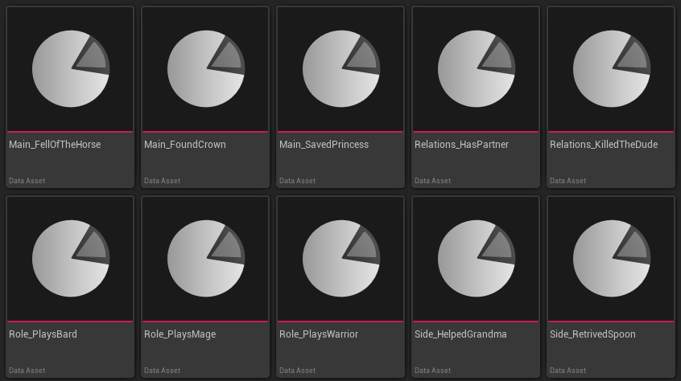

# Rule System

**Rule System** is an asset-based rules editor for Unreal Engine, built as part of **Chronicle**. It allows you to create custom **Conditions** and **Callbacks** that can be used in other gameplay systems.

## Example



## How To Set Up

### Add a callback

1. Create the directory: `Game/Rules/Callbacks`
2. Right-click in the Content Browser within that directory
3. Select **Miscellaneous → Data Asset**
4. Search for the **Rule Asset** type
5. Click **Select** to create a new callback rule

### Add a condition

1. Create the directory: `Game/Rules/Conditions`
2. Right-click in the Content Browser within that directory
3. Select **Miscellaneous → Data Asset**
4. Search for the **Rule Asset** type
5. Click **Select** to create a new condition rule

### Modify rule

1. Each rule has a **unique GUID** for identification
2. Double-click a rule to modify its **name**

## How To Use In Code

Access rules programmatically using the `FRuleDirectory`:

```cpp
// Fetch all rules from directories
FRuleDirectory::Refresh();

// Get all condition IDs
auto ConditionIds = FRuleDirectory::GetConditions()->GetSharedIds(); 
 
// Get a condition name by ID
auto ConditionName = FRuleDirectory::GetConditions()->GetName(MyGuid);

// Get all callback IDs
auto CallbackIds = FRuleDirectory::GetCallbacks()->GetSharedIds(); 
 
// Get a callback name by ID
auto CallbackName = FRuleDirectory::GetCallbacks()->GetName(MyGuid);
```

## Planned Features

- **Validator** – Detect conflicts or unused rules
- **Browser** – Visual exploration of all rules