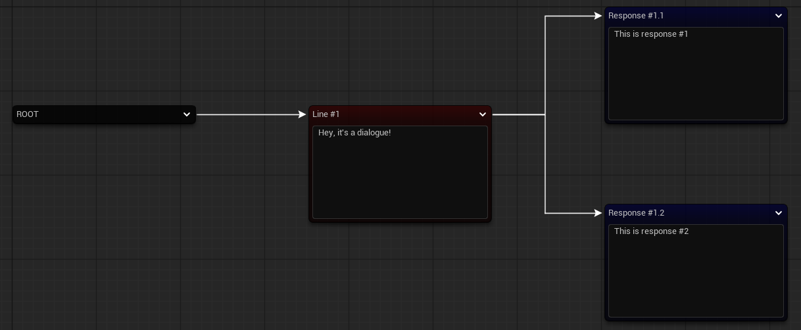
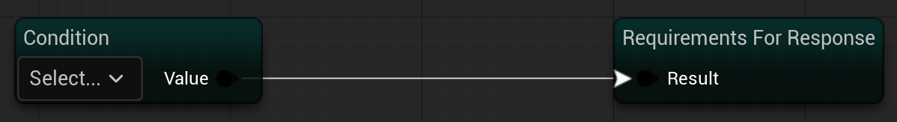
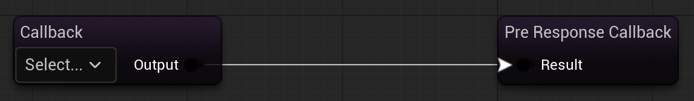
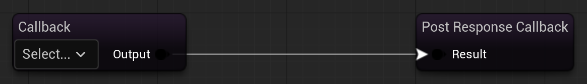
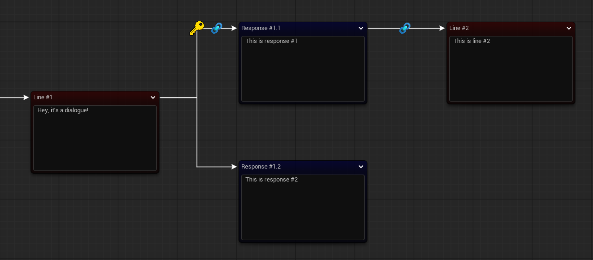

# Story System

**Story System** is a toolkit designed for creating rich, interactive narrative experiences in games. While still a work in progress, it already supports dialogue graph editing and will eventually include character database, rule-driven logic, cinematic timelines, and quest editor.

The system is designed to give game developers full control over storytelling mechanics, from branching dialogue paths to complex callback logic.

## Dialogue Graph (WIP)

### Current Features

-   **Branching Dialogue Paths**  
    
    
-   **Response Node Inner Graph**
    
    -   Requirements for response availability  
        
        
    -   Callbacks **before** response  
        
        
    -   Callbacks **after** response  
        
        
-   **Visuals of Response Node inner graph in main graph**  
    

### Planned Features

-   Rules based on user-defined assets instead of enums
-   Character lines separation
-   Link Nodes (to connect existing Line Nodes)

## Roadmap

1.  Rule System
2.  Character Database
3.  Cinematic Timeline
4.  Quest Editor

## Getting Started

> Instructions will be added soon once core systems stabilize.

## Contributing

Story System is open for contributions! If you'd like to help expand features, improve documentation, or provide bug fixes, please fork the repository and submit a pull request.