# Story System

**Story System** is an Unreal Engine plugin for building narrative-driven games. It gives developers a visual way to create branching dialogues, hook up game logic through a rule system, and eventually manage characters, quests, and cinematic timelines — all from within the editor.

## Dialogue Graph

### Current Features

-   **Branching Dialogue Paths**

    

-   **Node Collapsing**

    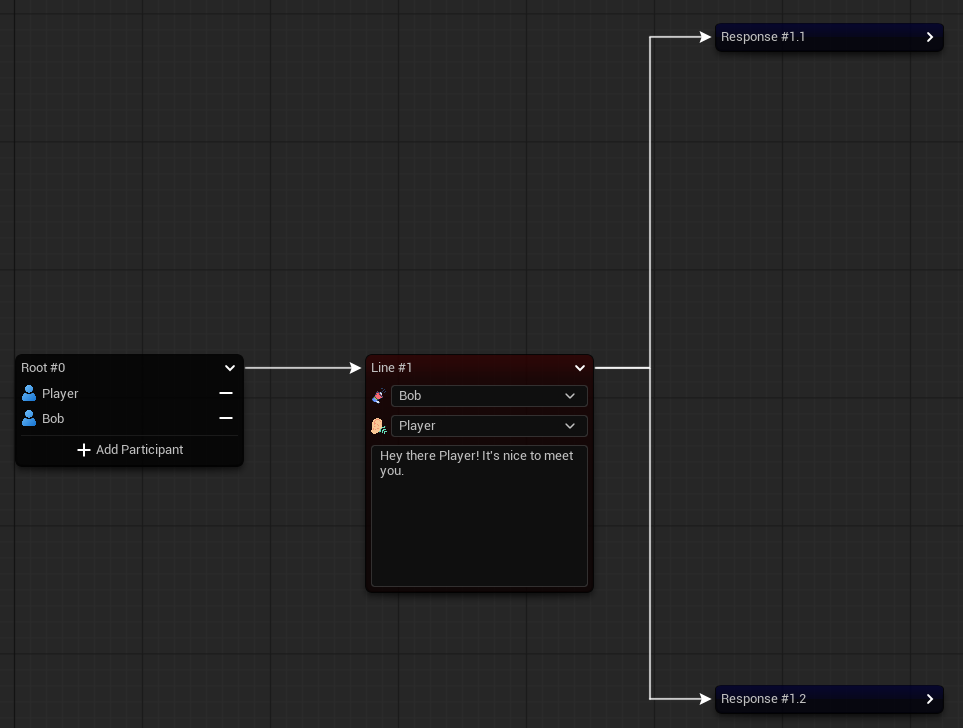
    
-   **Node Inner Graph**
    
    -   Requirements for node availability
  
        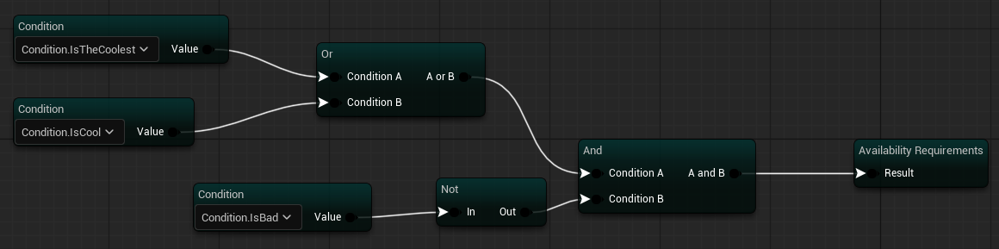
        
    -   Callbacks after node
 
        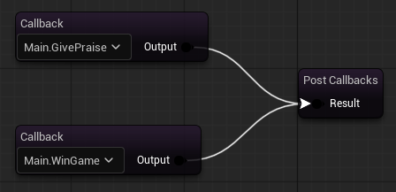

-   **Inner State Visualization: Key - Requirements & Link - Callbacks**

    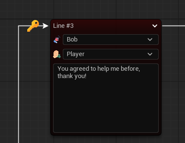

    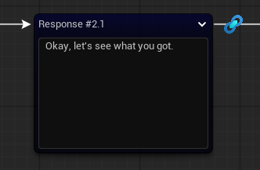

### How To Use

-   **Create Dialogue Graph:**

    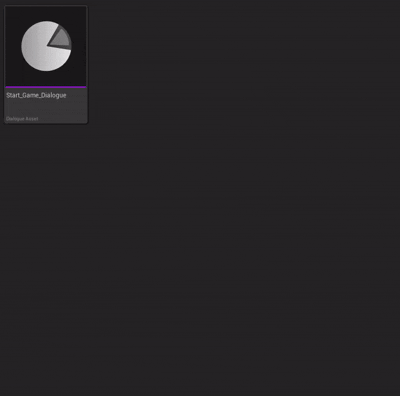

-   **Open Dialogue Graph:** Double LMB on `Dialogue Asset`

-   **Add Participants:**

    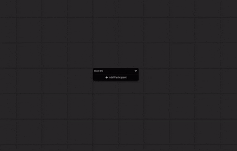

-   **Add Nodes:**

    

-   **Add Requirements:**

    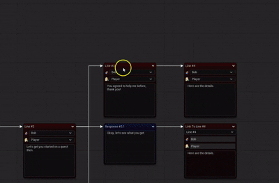

-   **Add Callbacks:**

    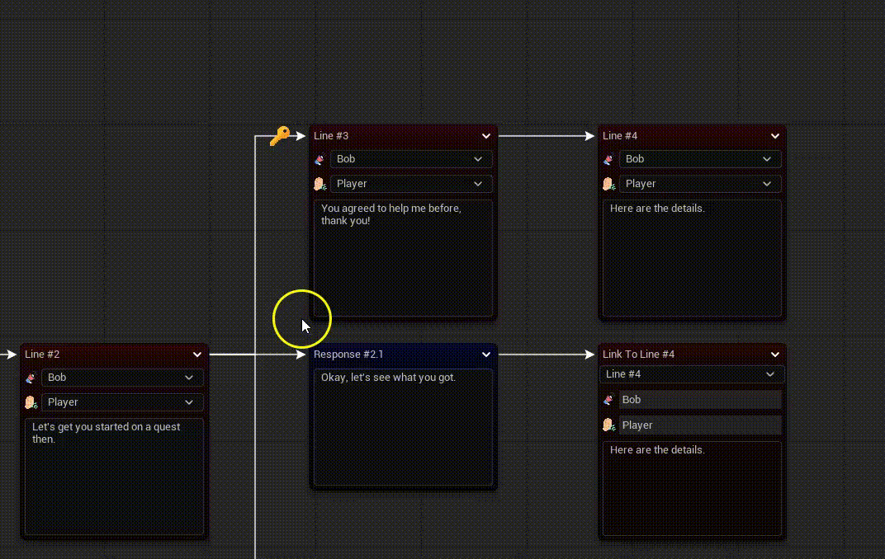

-   **Export To Runtime UObject:**

    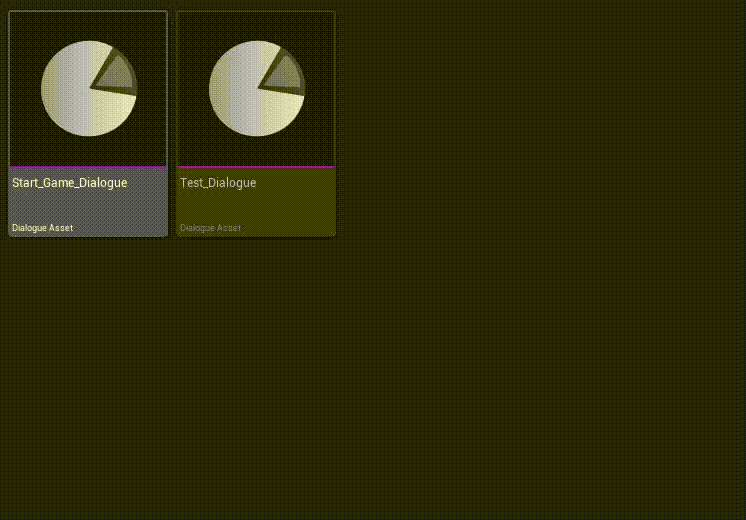

-   **Copy JSON To Clipboard:**

    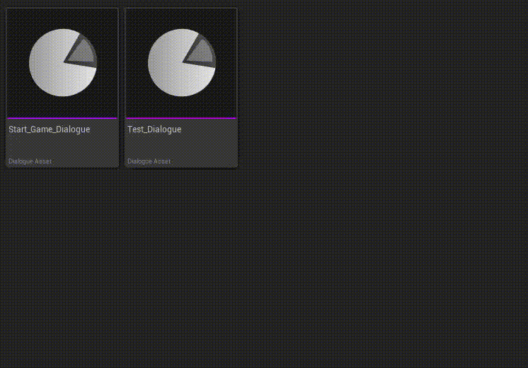

# Rule System (On Hold)

### Current Features

- Asset-based rules creation
- GUID-oriented rule recognition

### How To Use

-   **Create Rule (Inside `Game/Rules/Conditions` Or Inside `Game/Rules/Callbacks`):**

    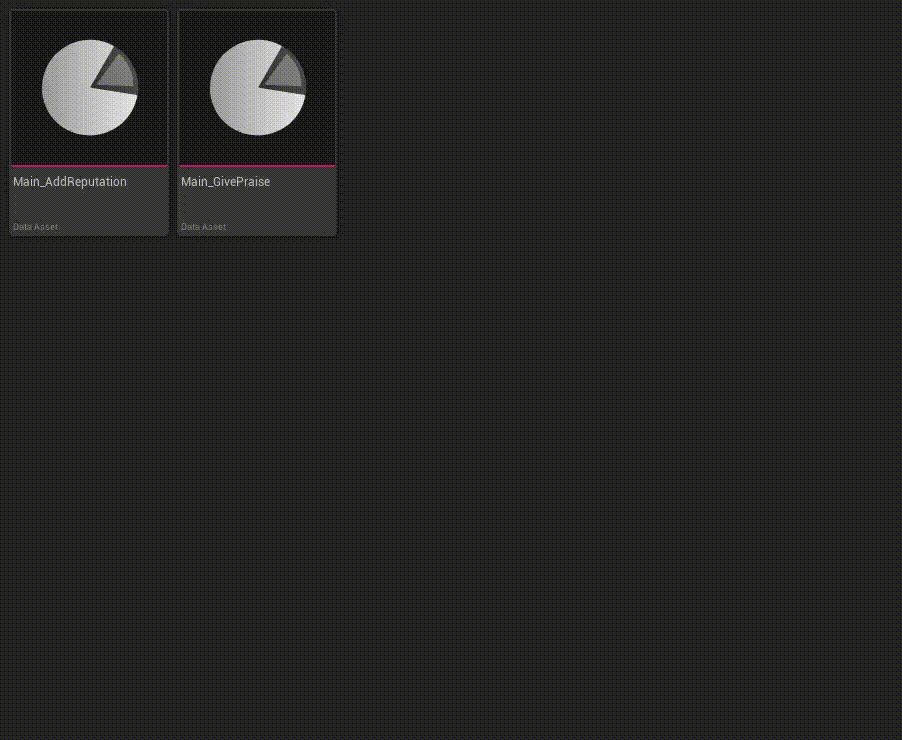

### Planned Features

- Browser for rules
- Validator

# Character System

### Current Features

- Asset-based character creation
- GUID-oriented character recognition

### How To Use

-   **Create Character (Inside `Game/Characters`):**

    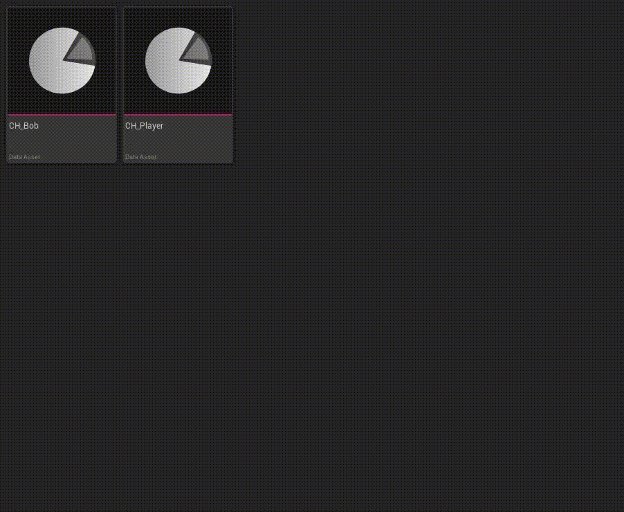

### Planned Features

- Browser for characters
- Validator

## Roadmap

1.  Cinematic Timeline
2.  Quest Editor

## Getting Started

> Instructions will be added soon once core systems stabilize.

## Contributing

Story System is open for contributions! If you'd like to help expand features, improve documentation, or provide bug fixes, please fork the repository and submit a pull request.
