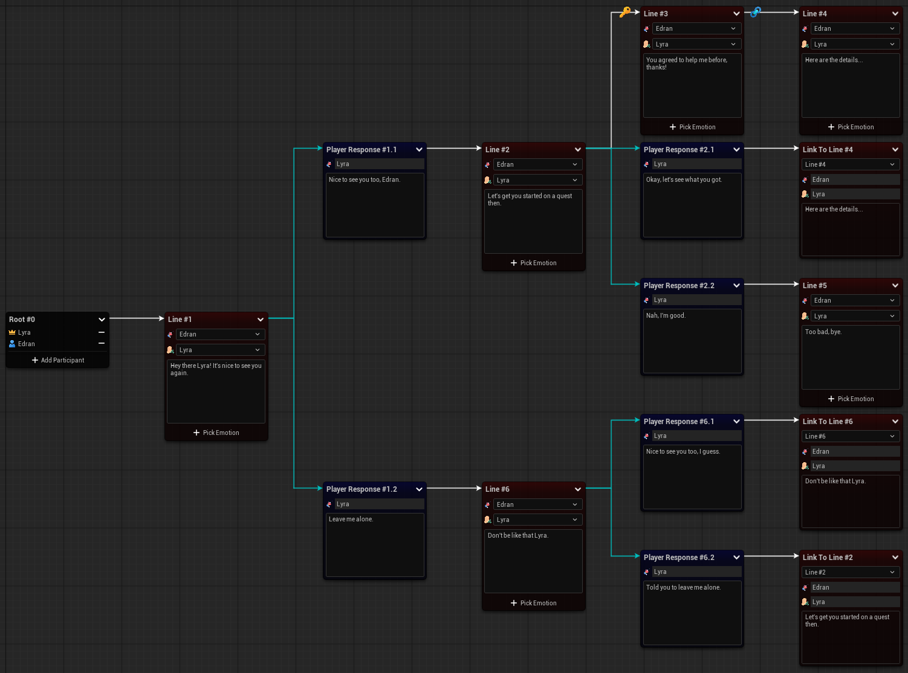
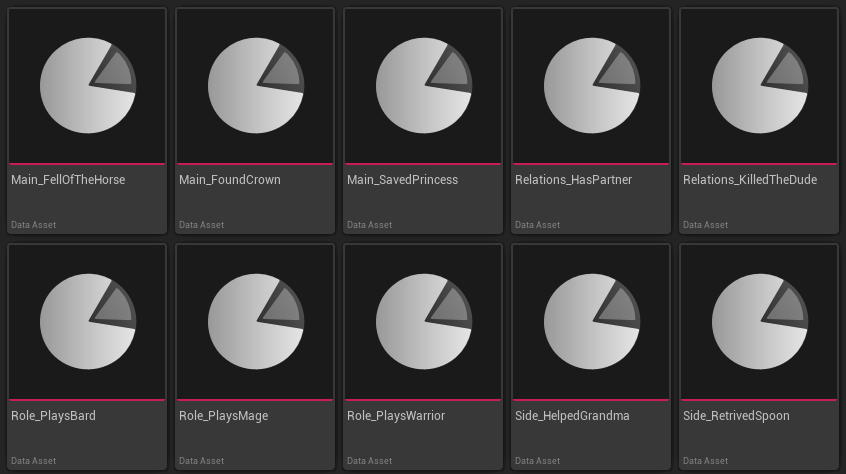
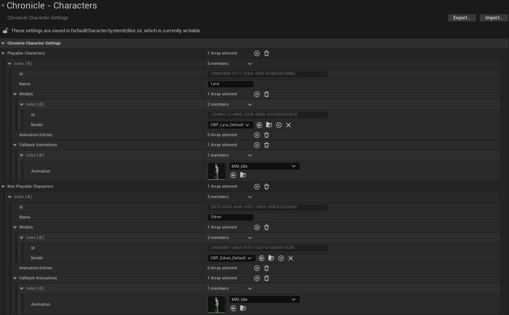

  

**Chronicle** is an Unreal Engine plugin for building narrative-driven games. It gives developers a visual way to create branching dialogues, hook up game logic through a rule system, manage characters, and cinematic timelines - all from within the editor.

## Modules

Chronicle is divided into separate modules for clarity and easier maintenance. Each module has its own detailed README in the `Docs/` folder.

### Dialogue System

[See full Dialogue System documentation →](Docs/DialogueSystem.md)

### Cinematic Timeline

[See full Cinematic Timeline documentation →](Docs/CinematicTimeline.md)

### Rule System

[See full Rule System documentation →](Docs/RuleSystem.md)

### Character System

[See full Character System documentation →](Docs/CharacterSystem.md)

> **Development paused.** Chronicle is currently on hold. It's been a solo project from the start, and without other contributors I don't have the bandwidth to keep active development going right now. The repository stays public and the code remains usable under the MIT license - feel free to clone, fork, or build on it. The roadmap below is kept for reference rather than as a committed plan. If you'd like to help revive the project, see Contributing.

## Roadmap (ish)

Planned features for Chronicle in no particular order:

- Smoothen transitions between sequences (Cinematic Timeline)
- Fix animation transitions (Cinematic Timeline)
- Add conversation flow debugger (Cinematic Timeline)
- Improve sequences generation (Cinematic Timeline)
- Add more designer-friendly project setup (Emotion Subsystem, Rule System and Character System)
- Localization support (Dialogue System and Cinematic Timeline)

## Installation

1.  Clone or download this repository
2.  Place the plugin in: `(Project)/Plugins/Chronicle`
3.  Open the project in Unreal Engine
4.  Enable  **Chronicle**  in: `Edit → Plugins → Tools`
5.  Restart the editor

## Requirements

-   Unreal Engine 5.x
-   Editor build

## How To Use

Usage and integration instructions are included in each module’s README:

- [Dialogue System](Docs/DialogueSystem.md) – Create and manage branching conversations with visual nodes
- [Cinematic Timeline](Docs/CinematicTimeline.md) – Convert dialogue graphs to in-game cinematic sequences
- [Character System](Docs/CharacterSystem.md) – Manage characters - models and animations
- [Rule System](Docs/RuleSystem.md) – Define game logic and conditions

## Sample Project

Chronicle has a sample project, which can be found here: https://github.com/janikowski-dev/Chronicle-Sample

## Contributing

Chronicle is open for contributions. Active development is paused, but the project is very much open to people who want to pick things up - bug fixes, documentation, or new features are all welcome. Fork the repository and submit a pull request, and feel free to open an issue first if you'd like to coordinate.
